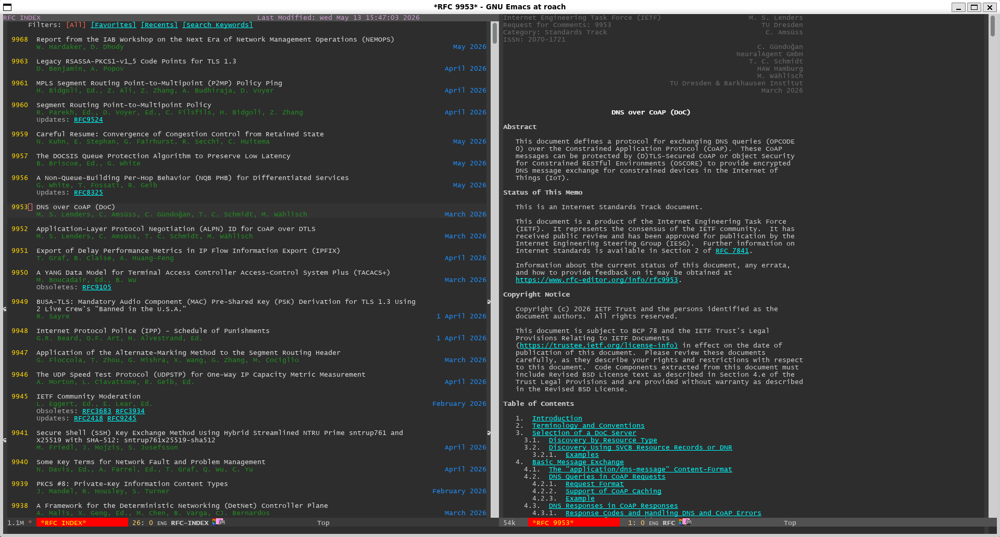
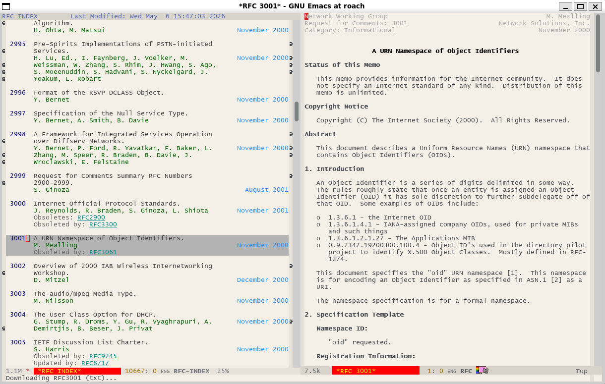

#+TITLE: RFCVIEW
#+AUTHOR: Yunsik Jang
#+SETUPFILE: https://fniessen.github.io/org-html-themes/org/html-theme-readtheorg.setup

*rfcview* is an Emacs tool for browsing, downloading, and reading IETF RFC documents inside Emacs. When you run *rfcview*, it updates the RFC index if necessary, then presents an interactive index buffer.

#+CAPTION: Dark theme

#+CAPTION: Light theme

* Features

- Browse the full up-to-date IETF RFC index with fancy and informative look.
- Filter by favorites, recently read, or keyword search (scored and ranked)
- Automatically download and display RFCs on demand.
- Rich read mode:
  - Applying style to RFC document
  - Jump by section
  - Seamless page breaks; looks like one continuous page

* Installation

** use-package :vc (Emacs 30+)

#+BEGIN_SRC emacs-lisp
(use-package rfcview
  :vc (:url "https://github.com/zeph1e/rfcview.el" :rev :newest)
  :commands rfcview)
#+END_SRC

** use-package with straight.el

#+BEGIN_SRC emacs-lisp
(use-package rfcview
  :straight (:host github :repo "zeph1e/rfcview.el" :files ("*.el"))
  :commands rfcview)
#+END_SRC

** Manual

Place all four =.el= files (=rfcview.el=, =rfcview-core.el=, =rfcview-index.el=, =rfcview-reader.el=) in the same directory and add:

#+BEGIN_SRC emacs-lisp
;; e.g. if placed in ~/.emacs.d/rfcview/
(add-to-list 'load-path "~/.emacs.d/rfcview")
(autoload 'rfcview "rfcview" t t)
#+END_SRC

* Usage

=M-x rfcview= opens the =*RFC INDEX*= buffer.

| Key       | Action                              |
|-----------+-------------------------------------|
| =RET= / =SPC= | Open RFC under point            |
| =n= / =p=     | Next / previous entry           |
| =v=           | Toggle favorite                 |
| =A=           | Show all                        |
| =F=           | Show favorites                  |
| =R=           | Show recently read              |
| =K=           | Keyword search                  |
| =#=           | Jump to RFC by number           |
| =f=           | Jump to filter line             |
| =g=           | Refresh index                   |
| =?=           | Help                            |
| =q=           | Bury buffer                     |

In an RFC read buffer:

| Key       | Action                              |
|-----------+-------------------------------------|
| =]= / =[=     | Next / previous section heading |
| =TAB= / =S-TAB= | Next / previous RFC cross-reference |
| =n= / =p=     | Next / previous line            |
| =j= / =k=     | Next / previous line (vi)       |
| =h= / =l=     | Backward / forward char (vi)    |
| =+= / =-=     | Increase / decrease font size   |
| =o=           | View raw cached file            |
| =?=           | Help                            |
| =q=           | Quit (refocus index if visible) |

* PDF support

** PDF Fallback

Some RFCs only present as PDF (e.g. RFC 8).  rfcview automatically falls back to PDF when a plain-text edition returns a 404 response, and also checks for a locally cached =.pdf= file before attempting a download.

Viewing PDFs requires [[https://github.com/vedang/pdf-tools][pdf-tools]].  rfcview does not declare a hard dependency on it; if pdf-tools is not installed, opening a PDF-only RFC signals an error.  Example setups:

#+BEGIN_SRC emacs-lisp
(use-package pdf-tools
  :ensure t
  :magic ("%PDF" . pdf-view-mode)
  :config
  (pdf-tools-install :no-query))
#+END_SRC

** Forcing PDF Only

To always open RFCs as PDF (even when a plain-text edition exists), customize =rfcview:preferred-format=:

#+BEGIN_SRC emacs-lisp
  (use-package rfcview
    :vc (:url "https://github.com/zeph1e/rfcview.el" :rev :newest)
    :commands rfcview
    :custom (rfcview:preferred-format 'pdf))
#+END_SRC

* License

[[http://www.wtfpl.net][WTFPL version 2]]
