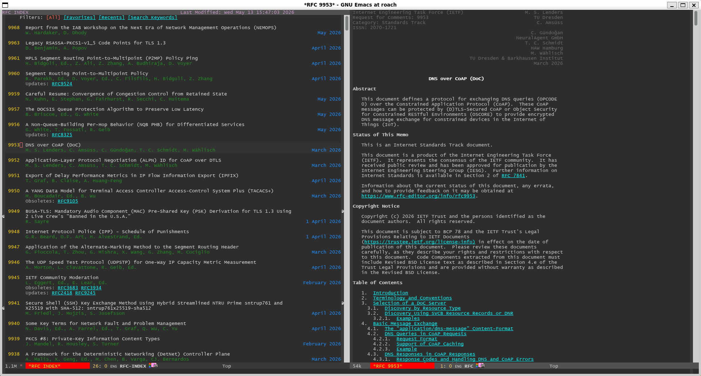
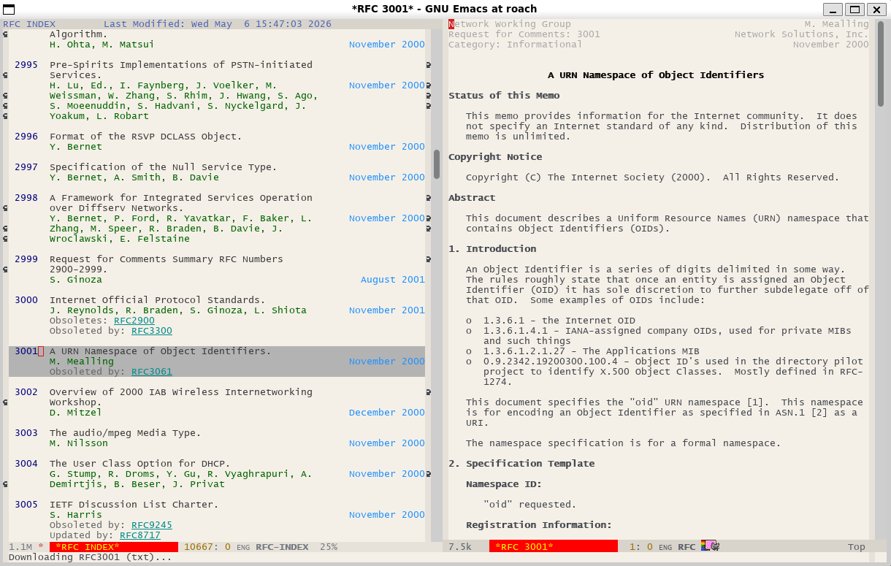

#+TITLE: RFCVIEW
#+AUTHOR: Yunsik Jang
#+SETUPFILE: https://fniessen.github.io/org-html-themes/org/html-theme-readtheorg.setup

*rfcview* is an Emacs tool for browsing, downloading, and reading IETF RFC documents inside Emacs. When you run *rfcview*, it updates the RFC index if necessary, then presents an interactive index buffer.

* Screenshots

#+CAPTION: Dark theme

#+CAPTION: Light theme

* Features

- Browse the full up-to-date IETF RFC index with fancy and informative look.
- Filter by favorites, recently read, or keyword search (scored and ranked)
- Automatically download and display RFCs on demand.
- Multi-format support driven by the rfc-index: TXT and PDF render inside Emacs (PDF requires pdf-tools); HTML and XML open in the browser via =browse-url=
- Rich read mode:
  - Applying style to RFC document
  - Jump by section
  - Clickable TOC entries, RFC cross-references, and URLs
  - History back / forward across followed links
  - Seamless page breaks; looks like one continuous page
  - Inline Google Translate overlays — per-paragraph or whole-document, asynchronous, cache-aware

* Installation

** use-package :vc (Emacs 30+)

#+BEGIN_SRC emacs-lisp
(use-package rfcview
  :vc (:url "https://github.com/zeph1e/rfcview.el" :rev :newest)
  :commands rfcview)
#+END_SRC

** use-package with straight.el

#+BEGIN_SRC emacs-lisp
(use-package rfcview
  :straight (:host github :repo "zeph1e/rfcview.el" :files ("*.el"))
  :commands rfcview)
#+END_SRC

** Manual

Place all four =.el= files (=rfcview.el=, =rfcview-core.el=, =rfcview-index.el=, =rfcview-reader.el=) in the same directory and add:

#+BEGIN_SRC emacs-lisp
;; e.g. if placed in ~/.emacs.d/rfcview/
(add-to-list 'load-path "~/.emacs.d/rfcview")
(autoload 'rfcview "rfcview" t t)
#+END_SRC

* Usage

=M-x rfcview= opens the =*RFC INDEX*= buffer.

| Key             | Action                                                             |
|-----------------+--------------------------------------------------------------------|
| =RET= / =SPC=   | Open RFC under point                                               |
| =n= / =p=       | Next / previous entry                                              |
| =TAB= / =S-TAB= | Next / previous button                                             |
| =v=             | Toggle favorite                                                    |
| =A=             | Show all                                                           |
| =F=             | Show favorites                                                     |
| =R=             | Show recently read                                                 |
| =K=             | Keyword search                                                     |
| =#=             | Jump to RFC by number                                              |
| =f=             | Jump to filter line                                                |
| =s=             | Toggle sort order (asc / desc by RFC number; All / Favorites only) |
| =g=             | Refresh index                                                      |
| =?=             | Help                                                               |
| =q=             | Bury buffer                                                        |

In an RFC read buffer:

| Key                   | Action                                                          |
|-----------------------+-----------------------------------------------------------------|
| =]= / =[=             | Next / previous section heading                                 |
| =j=                   | Jump to section by number or title                              |
| =TAB= / =S-TAB=       | Next / previous link (RFC ref, TOC entry, URL)                  |
| =RET=                 | Follow link under point                                         |
| =B= / =F=             | History back / forward (after following an RFC or section link) |
| =C-c C-b= / =C-c C-f= | Same, chord form                                                |
| =n= / =p=             | Next / previous line                                            |
| =b= / =f=             | Backward / forward char                                         |
| =+= / =-= / =0=       | Increase / decrease / reset font size                           |
| =o=                   | View raw cached file                                            |
| =t=                   | Translate paragraph at point or region (see /Translation/)      |
| =T=                   | Whole-document translate / cancel / hide / restore              |
| =l=                   | Change target translation language                              |
| =?=                   | Help                                                            |
| =q=                   | Quit (refocus index if visible)                                 |

* Reading formats

rfcview reads the =(Format: ...)= trailer of each entry in the rfc-index and only tries formats the index advertises. The four supported values for =rfcview:preferred-format= are:

| Value   | Where it opens                                  | Cached locally? |
|---------+-------------------------------------------------+-----------------|
| =txt=   | Emacs read mode (default)                       | yes             |
| =pdf=   | Emacs =pdf-view-mode= (requires pdf-tools)      | yes             |
| =html=  | External browser via =browse-url=               | no              |
| =xml=   | External browser via =browse-url=               | no              |

** Selection rules

When the index lists =rfcview:preferred-format=, it leads; the remaining listed supported formats follow as fallback (so a broken =txt= link can still resolve to =pdf= if the index lists both). When the index does *not* list the preferred format, it is dropped — the index is authoritative — and the listed supported formats are tried instead. If nothing supported is listed, rfcview reports the RFC as unavailable.

Some RFCs only present as PDF (e.g. RFC 8); rfcview picks up the index's =(Format: PDF=...)= and opens the PDF directly. Likewise for HTML/XML-only entries.

** PDF support

Viewing PDFs requires [[https://github.com/vedang/pdf-tools][pdf-tools]]. rfcview does not declare a hard dependency on it; if pdf-tools is not installed, opening a PDF-only RFC signals an error. Example setup:

#+BEGIN_SRC emacs-lisp
(use-package pdf-tools
  :ensure t
  :magic ("%PDF" . pdf-view-mode)
  :config
  (pdf-tools-install :no-query))
#+END_SRC

** Customizing the preferred format

#+BEGIN_SRC emacs-lisp
  (use-package rfcview
    :vc (:url "https://github.com/zeph1e/rfcview.el" :rev :newest)
    :commands rfcview
    :custom (rfcview:preferred-format 'pdf))   ; or 'txt, 'html, 'xml
#+END_SRC

* Translation

#+CAPTION: Translation
file:res/rfcview-tr.png

rfcview can translate RFC paragraphs in place via the unofficial Google Translate gtx endpoint — no API key required. The original buffer text is never modified; translations appear as overlays whose =display= property visually replaces the original. =buffer-substring= still returns the English, and =copy/paste= yields English.

** Keys

| Key | Action                                                                                                                                                                                                                                                                |
|-----+-----------------------------------------------------------------------------------------------------------------------------------------------------------------------------------------------------------------------------------------------------------------------|
| =t= | Four-way dispatch (see below)                                                                                                                                                                                                                                         |
| =T= | Translate every paragraph in the document, async-serial, visible area first. Pressing =T= while a job is running cancels it and restores the original text. After completion, =T= toggles all overlays on / off; cached paragraphs reappear instantly without network. |
| =l= | Prompt for a different target language. The choice is persisted via Customize and clears any cached translations (they belonged to the previous language).                                                                                                            |

The =t= key dispatches in this order:

1. *Any region-translation overlay is visible* → hide them all (point position irrelevant). Pressing =t= anywhere is the cleanup gesture for the additive region overlays.
2. *Active region (mark)* → translate the marked range as an additive overlay. If the region spans multiple paragraphs, it is split at blank-line boundaries and each paragraph chunk gets its own overlay so the original's per-paragraph shape is preserved. Does **not** disturb the paragraph SINGLE/ALL state — region and paragraph overlays coexist.
3. *Point on a blank line, no region overlays* → if a SINGLE paragraph overlay is on, hide it.
4. *Inside a paragraph* → the paragraph state machine: pressing =t= in a different paragraph restores the previous one and translates the new one; in the same paragraph, toggles off.

=t= (paragraph mode) and =T= (document mode) are mutually exclusive: at most one paragraph-=t= overlay is visible at a time, and =T= absorbs any pre-existing =t= overlay into the document set. Region overlays are independent of both — they're an additive layer that =t= cleans up before doing anything else.

** Language selection

On the first translation in a session, rfcview prompts for the target language using Google Translate's live supported-languages API (no hand-coded list). The completion default is derived from =current-language-environment= (e.g. =Korean= → =ko=). The selected ISO 639 code is saved to the =rfcview:translate-target-language= defcustom; subsequent sessions skip the prompt. Press =l= at any time to switch.

** Layout and behavior

- The translated overlay's wrap width matches the original paragraph's widest line, with the document-wide widest line as a floor so short paragraphs don't render narrower than the surrounding text. A small slack accounts for word-boundary wrapping leaving CJK lines short of the right margin.
- Internal whitespace runs (including hard-wrap newlines and per-line indentation) are flattened to single spaces before being sent to the translator — otherwise Google's segmentation gets confused by RFC-style hard wraps.
- After a single-paragraph translation, point is moved to the end of the paragraph and =window-start= is preserved, so the buffer does not scroll.
- All translations are cached per-buffer for the session, so re-toggling never re-hits the network.

** Caveats

- The gtx endpoint is unofficial; Google can change it at any time. If translations stop working, check =rfcview:translate-endpoint= and =rfcview:translate-languages-endpoint=.
- Long ASCII art, code listings, or pre-formatted tables won't translate sensibly — use the region form (=t= with a marked range) to keep them out of the input.

* License

[[http://www.wtfpl.net][WTFPL version 2]]
